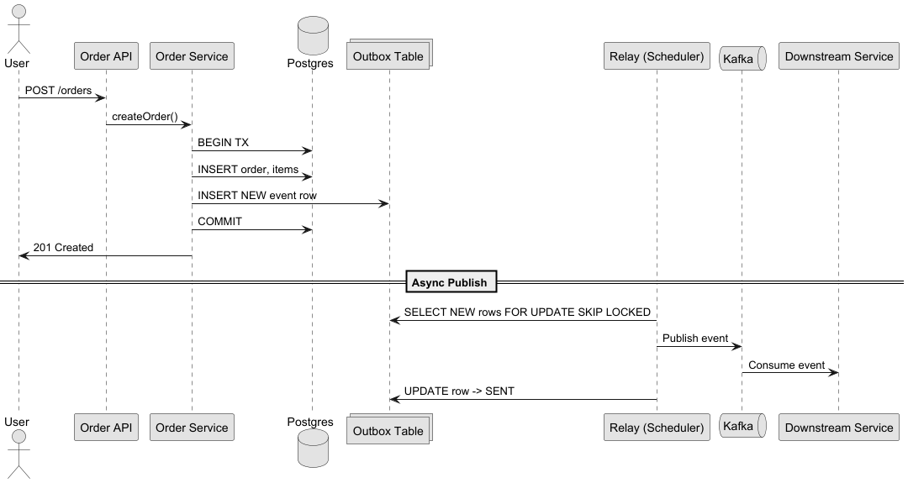
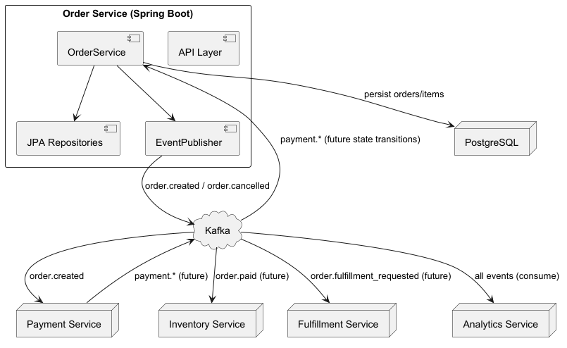
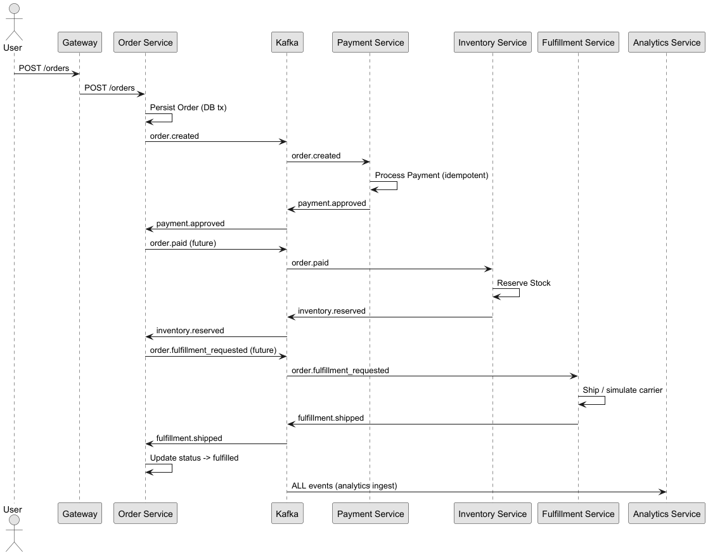
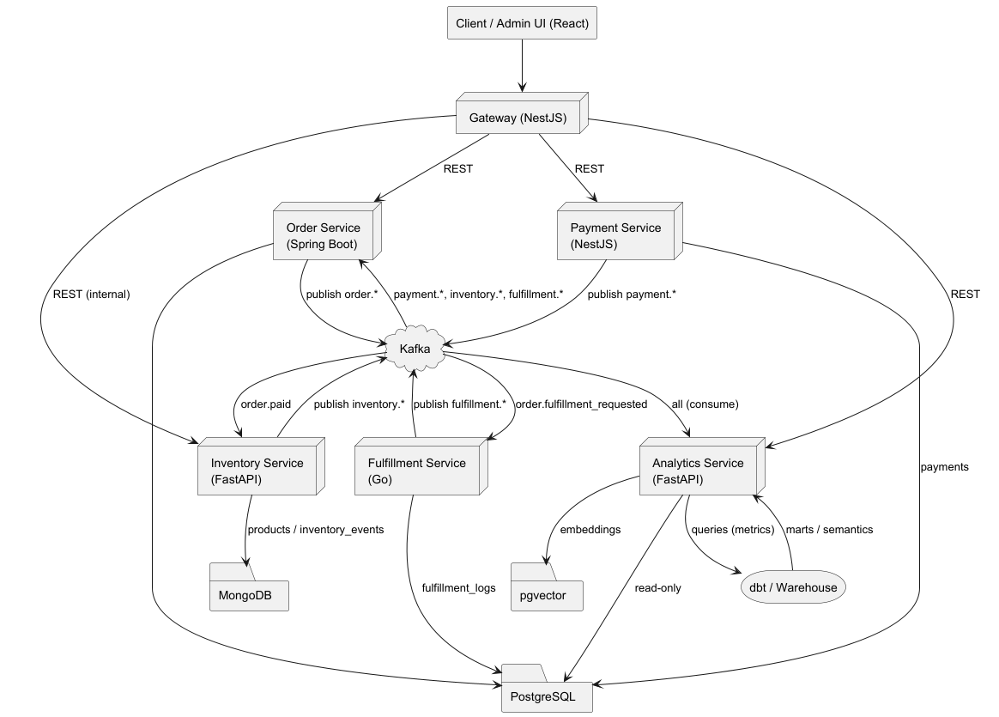

# Order Service

[](https://github.com/ORG_NAME/mini-commerce/actions/workflows/ci.yml)

The **Order Service** is the authoritative source for order management in Mini-Commerce. It owns the order domain, enforces status transitions, and reliably publishes domain events to Kafka using the transactional outbox pattern.

> OpenAPI: See the generated specification at [`src/main/resources/openapi/order-service.yaml`](src/main/resources/openapi/order-service.yaml)

## Purpose & Responsibilities
- **Owns**: Orders, status machine
- **Publishes**: order.created, order.paid, order.fulfillment_requested, order.cancelled, order.completed
- **Consumes**: payment.approved|declined, inventory.reserved|rejected, fulfillment.shipped|failed
- **DB**: PostgreSQL (orders, order_items)

## API Endpoints
- `POST /orders` → Creates order, emits `order.created`
- `GET /orders/{id}` → Fetch order
- `PATCH /orders/{id}/cancel` → Cancels order, emits `order.cancelled`

See [OpenAPI spec](src/main/resources/openapi/order-service.yaml).

## Event Publishing & Reliability

Events are published to Kafka using a **transactional outbox** pattern:
- Order changes and event records are committed atomically in the DB
- A background process reads outbox rows and publishes to Kafka
- Ensures exactly-once, reliable event delivery even if Kafka is temporarily unavailable
- See [ADR: Transactional Outbox](../docs/adr/0001-transactional-outbox-for-domain-events.md)



## Error Handling & Resilience
- If Kafka is down, events are retried from the outbox
- No silent fail: events are guaranteed to be published, with observability and alerting
- Outbox rows are only deleted after successful publish
- Metrics and traces are emitted for all event operations

## Testing & Local Development
- **Unit & Integration Tests**: JUnit5, Testcontainers (Kafka, Postgres)
- **Run tests**:
  ```sh
  ./gradlew test
  ```
- **Local dev**: See [../README.md](../README.md) for Docker Compose setup

## Diagrams
- 
- 
- 

## Observability
- OpenTelemetry traces, correlation IDs (orderId)
- Centralized logging, metrics

## Further Reading
- [Transactional Outbox ADR](../docs/adr/0001-transactional-outbox-for-domain-events.md)
- 
- [OpenAPI Spec](src/main/resources/openapi/order-service.yaml)

## Event Envelope (Implemented)
Domain events are emitted via the transactional outbox as an EventEnvelope structure:

```
{
  "eventId": "<uuid>",
  "type": "order.created",
  "version": "v1",
  "occurredAt": "2025-09-09T10:00:00Z",
  "aggregateType": "order",
  "aggregateId": "<order-uuid>",
  "traceId": "<trace-uuid>",
  "data": {
    "orderId": "<order-uuid>",
    "customerId": "<customer-uuid>",
    "currency": "USD",
    "total": 39.98,
    "items": [ { "sku": "SKU1", "name": "Mouse", "quantity": 2, "unitPrice": 19.99 } ],
    "createdAt": "2025-09-09T10:00:00Z"
  }
}
```

## Metrics (Micrometer)
- `orders.outbox.pending`
- `orders.outbox.failed`
- `orders.outbox.backlog.oldest_age_seconds`
- `orders.outbox.relay.batch.duration` (timer)
- `orders.outbox.publish.attempt{status=success|failure}`

## Health & Monitoring
The service exposes Spring Boot Actuator health at:

```
GET /actuator/health
```
Example (DEGRADED when failed outbox rows exist):
```
{
  "status": "DEGRADED",
  "components": {
    "outboxHealthIndicator": {
      "status": "DEGRADED",
      "details": {
        "outbox.pending": 12,
        "outbox.failed": 2,
        "outbox.oldestAgeSeconds": 187
      }
    }
  }
}
```
When there are no failed events the status returns `UP` and failed count is 0.

Curl quick check:
```
curl -s http://localhost:8080/actuator/health | jq
```

Key fields:
- `outbox.pending`: total NEW + RETRY events waiting publishing
- `outbox.failed`: events that exhausted max attempts (operational action required)
- `outbox.oldestAgeSeconds`: age of the oldest pending event, useful for alert thresholds

## Admin Endpoints (Outbox Operations)
| Method | Path | Description |
|--------|------|-------------|
| POST | /api/v1/outbox/requeue-failed | Requeue all FAILED events (status -> RETRY) |
| POST | /api/v1/outbox/{id}/requeue | Requeue single event by id |

---

For questions, see the global [README](../README.md) or reach out to the team.
